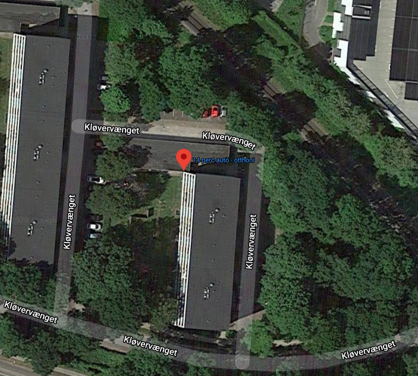
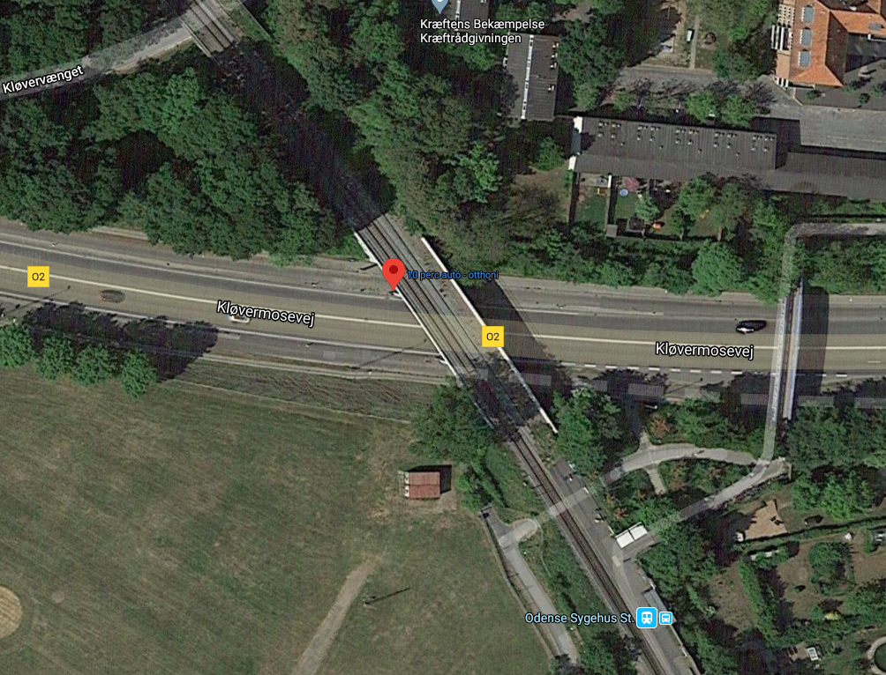
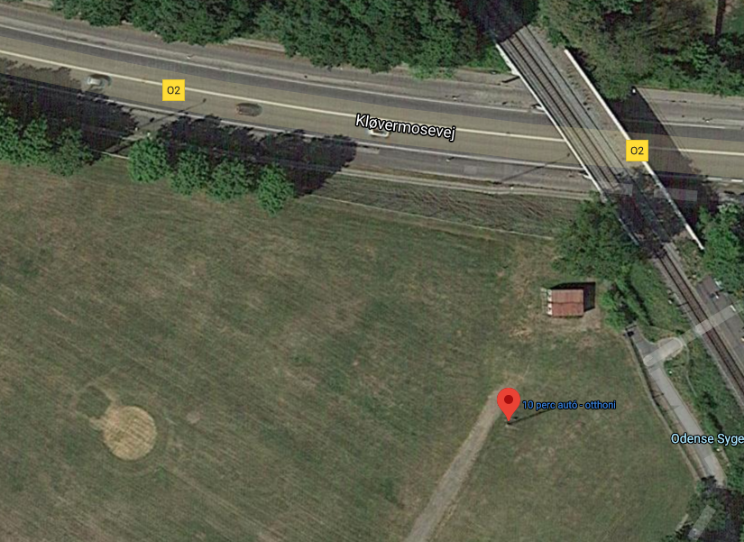
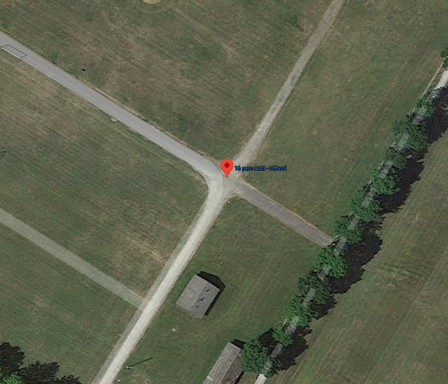

Table of 4 points on image and their UTM coordinates

Point | Geo | Geo | UTM | UTM | IMG (X, Y)
--- | --- | --- | --- | --- | --- | ---
Picture | Lon (E) | Lat (N) | Easting (X) | Northing (Y) | (X, Y)
 | 10.363997 | 55.382782 | 586417.3794014237 | 6138234.964123087 | (231, 553)
 | 10.365896 | 55.381956 | 586539.4879360864 | 6138145.410182816 | (697, 310)
 | 10.365814 | 55.381420 | 586535.4632636021 | 6138085.66494489 | (910, 302)
 | 10.365092 | 55.380826 | 586491.0179540929 | 6138018.670434019 | (1225, 369)

The distance between point #3 and #4 is roughly 80-81 metres.
Their pixel coordinates on the warped image are (900, 1703) for #4 and (1255, 1156) for #3 which makes the eucledian pixel distance about 652 pixels.
The GSD value, in metres/pixel, is therefore roughly 80.5/652 = **0.123 metres/pixel**